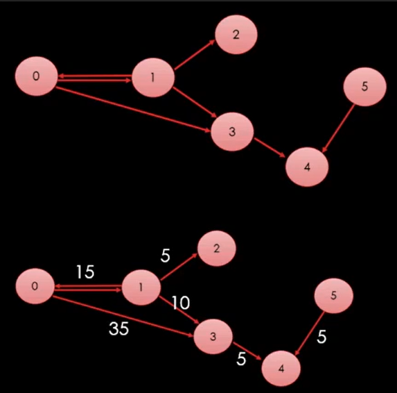

# 그래프

## 그래프의 개념

[현실 세계의 사물이나 추상적 개념 간]의 [연결 관계]를 표현

- 정점(Vertex) : 데이터를 표현 (사물, 개념 등)
- 간선(Edge) : 정점들을 연결하는데 사용

## 그래프의 예시

ex) 소셜 네트워크 관계도

### 가중치 그래프(Weighted Graph)

ex) 지하철 노선도

### 방향 그래프(Directed Graph)

ex) 일방 통행이 포함된 도로망	

ex) 두 사람 사이의 호감도

